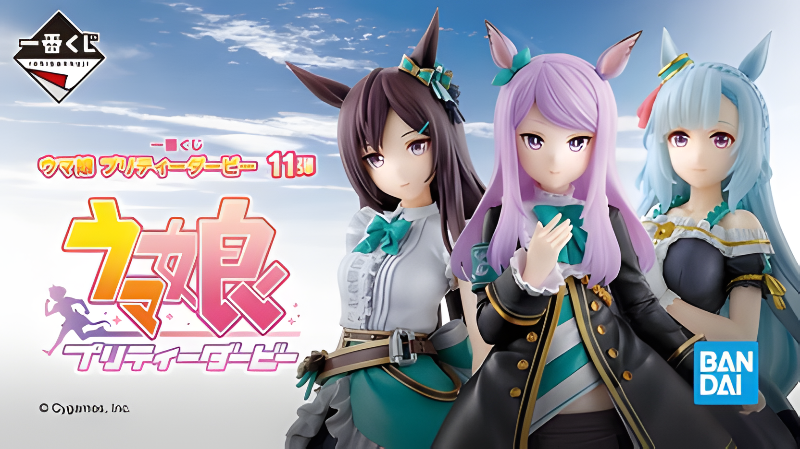

# Nicolai Store — Manual de Uso

Guía completa para mantener y actualizar el catálogo de figuras de anime.

---

## ESTRUCTURA DE ARCHIVOS

```
web4/
├── index.html          ← Toda la tienda vive aquí (productos, banners, header)
├── css/styles.css      ← Estilos y colores
├── js/main.js          ← Comportamiento del modal y carrusel
└── images/
    ├── logo.png            ← Logo del header (PNG transparente, ~200x200px)
    ├── logo-small.png      ← Favicon de la pestaña (~64x64px)
    ├── banners/            ← Imágenes del carrusel superior
    │   ├── banner-1.jpg
    │   ├── banner-2.jpg
    │   └── banner-3.jpg
    └── productos/          ← Imágenes de productos y miniaturas
        ├── producto.jpg
        ├── producto-vista2.jpg
        └── producto-caja.jpg
```

---

## CÓMO AGREGAR UN PRODUCTO

Abre `index.html`, busca la sección `CATÁLOGO DE PRODUCTOS` y copia el bloque de plantilla al final (antes del comentario de cierre):

```html
<div class="card"
     data-thumbnails="images/productos/producto-vista2.jpg, images/productos/producto-caja.jpg"
     data-specs='[
       {"icon":"fas fa-tag",       "label":"Marca",      "value":"Nombre marca"},
       {"icon":"fas fa-film",      "label":"Franquicia", "value":"Nombre franquicia"},
       {"icon":"fas fa-box-open",  "label":"Estado",     "value":"Sellado / Sin abrir"},
       {"icon":"fas fa-medal",     "label":"Condición",  "value":"Caja 10/10 · Figura 10/10"}
     ]'>
  <div class="card-image">
    
  </div>
  <div class="card-body">
    <h3>Nombre del Producto</h3>
    <div class="price">S/ 000</div>
    <div class="stock">🟧 Stock: 1 unidad disponible</div>
    <div class="btn-group">
      <button class="btn btn-desc" onclick="openModal(this)">Ver descripción</button>
    </div>
  </div>
</div>
```

### Campos a rellenar

| Campo | Dónde está | Qué poner |
|---|---|---|
| Imagen principal | `src="images/productos/..."` | Ruta de la foto principal |
| Nombre | `<h3>...</h3>` | Nombre completo del producto |
| Precio | `<div class="price">` | Ej: `S/ 450` |
| Miniaturas | `data-thumbnails="..."` | Rutas separadas por comas (dejar vacío si no hay) |
| Especificaciones | `data-specs='[...]'` | Ver sección siguiente |

---

## CÓMO EDITAR LAS ESPECIFICACIONES DEL MODAL

Cada producto tiene su propio atributo `data-specs` en la tarjeta (`index.html`). Solo edita los `"value"` de cada línea:

```html
data-specs='[
  {"icon":"fas fa-tag",       "label":"Marca",      "value":"← EDITA ESTO"},
  {"icon":"fas fa-film",      "label":"Franquicia", "value":"← EDITA ESTO"},
  {"icon":"fas fa-box-open",  "label":"Estado",     "value":"← EDITA ESTO"},
  {"icon":"fas fa-medal",     "label":"Condición",  "value":"← EDITA ESTO"}
]'
```

### Valores habituales por campo

**Estado:**
- `Sellado / Sin abrir`
- `Abierto / Exhibido`
- `Abierto / Nunca exhibido`

**Condición:**
- `Caja 10/10 · Figura 10/10`
- `Caja 9/10 · Figura 10/10`
- `Sin caja · Figura 10/10`

### Agregar o quitar una spec

Para añadir una línea nueva, agrega un objeto JSON al array:
```json
{"icon":"fas fa-ruler", "label":"Tamaño", "value":"25 cm"}
```
Para quitarla, borra esa línea (respetando las comas entre objetos).

Los íconos son de [Font Awesome 6](https://fontawesome.com/icons). Busca el nombre y úsalo como `"fas fa-nombre"`.

---

## CÓMO AGREGAR MINIATURAS AL MODAL

Las miniaturas son imágenes adicionales que aparecen debajo de la foto principal al abrir "Ver descripción".

```html
data-thumbnails="images/productos/figura-vista2.jpg, images/productos/figura-caja.jpg"
```

- Separa las rutas con comas
- Todas deben estar en `images/productos/`
- La imagen principal de la tarjeta siempre aparece como primera miniatura automáticamente
- Si no hay miniaturas, omite el atributo `data-thumbnails`

---

## CÓMO AGREGAR UN BANNER

1. Coloca la imagen en `images/banners/` (tamaño recomendado: 1200×380px)
2. En `index.html`, busca `banner-slides` y agrega:

```html
<div class="banner-slide">
  
  <div class="banner-overlay">
    <div class="banner-text">Título del banner</div>
    <div class="banner-subtext">Subtítulo del banner</div>
  </div>
</div>
```

---

## CÓMO MARCAR UN PRODUCTO COMO VENDIDO

Cambia el texto del stock en la tarjeta (`index.html`):

```html
<!-- Disponible -->
<div class="stock">🟧 Stock: 1 unidad disponible</div>

<!-- Vendido -->
<div class="stock">🔴 Vendido</div>
```

**El producto se moverá automáticamente al final del catálogo** al recargar la página, y mostrará una etiqueta roja "VENDIDO" sobre la imagen.

Cuando quieras eliminarlo definitivamente, borra el bloque `<div class="card">...</div>` completo.

---

## CÓMO ACTIVAR UNA OFERTA EN UN PRODUCTO

Durante temporadas de descuento, aplica estos cambios a la tarjeta en `index.html`:

**Antes (precio normal):**
```html
<div class="card" ...>
  ...
  <div class="price">S/ 459</div>
```

**Durante la oferta:**
```html
<div class="card card--offer" ...>
  ...
  <div class="price price--offer" data-original="S/ 459">S/ 350</div>
```

El precio tachado aparece solo a la izquierda del nuevo precio — no hay elemento HTML extra.

### Qué activa cada cambio

| Cambio | Efecto visual |
|---|---|
| `class="card--offer"` (en el card) | Borde rojo + badge animado "🔥 OFERTA" sobre la imagen |
| `class="price--offer"` (en el precio) | Precio rebajado en rojo |
| `data-original="S/ 000"` (en el precio) | Precio tachado a la izquierda (tarjeta y modal) |

**Para quitar la oferta:**
1. Quitar `card--offer` del class del card
2. En el precio: volver a `class="price"` y eliminar `data-original`

---

## PERSONALIZACIÓN RÁPIDA

| Qué cambiar | Archivo | Buscar |
|---|---|---|
| Número de WhatsApp | `index.html` | `51967311920` |
| Redes sociales | `index.html` | `class="socials"` |
| Colores del tema | `css/styles.css` | `#ff8a00` |
| Velocidad carrusel | `js/main.js` | `slideDelay` |
| Tamaño del logo | `css/styles.css` | `.site-logo` |

> El botón **"Consultar por WhatsApp"** del modal envía automáticamente el nombre e imagen de cada figura. El número se lee del HTML automáticamente — solo actualízalo en `index.html`.

---

## ORGANIZACIÓN DE IMÁGENES

```
images/
├── logo.png             ← PNG transparente, ~200x200px
├── logo-small.png       ← Favicon, ~64x64px
├── banners/             ← Solo banners del carrusel (1200×380px)
└── productos/           ← Fotos de productos y sus miniaturas
```

### Herramientas recomendadas

- [TinyPNG](https://tinypng.com/) — comprimir imágenes (RECOMENDADO antes de subir)
- [Upscayl](https://upscayl.org/) — mejorar resolución con IA (para fotos de baja calidad)
- [Squoosh](https://squoosh.app/) — optimizador avanzado de Google
- [Remove.bg](https://remove.bg/) — quitar fondo de imágenes
- [Canva](https://canva.com/) — crear banners con medidas exactas
- [Favicon.io](https://favicon.io/) — generar favicon desde el logo

---

## FLUJO SEMANAL DE ACTUALIZACIÓN

1. Fotografiar la figura con buena iluminación
2. Optimizar con TinyPNG (o mejorar con Upscayl si es necesario)
3. Mover a `images/productos/`
4. Abrir `index.html` y copiar la plantilla de producto
5. Rellenar nombre, precio, ruta de imagen y `data-specs`
6. Probar localmente abriendo `index.html` en el navegador
7. Subir cambios:
   ```bash
   git add .
   git commit -m "Nuevo producto: nombre del producto"
   git push
   ```
8. Vercel actualiza automáticamente en ~30 segundos

---

## SEO — CONFIGURACIÓN INICIAL

Antes de publicar, abre `index.html` y reemplaza `TU-DOMINIO.vercel.app` con tu URL real (aparece en 5 lugares: Open Graph, Twitter Card y JSON-LD):

```
https://TU-DOMINIO.vercel.app  →  https://nicolaistore.vercel.app
```

También actualiza en el JSON-LD:
- `telephone`: tu número real
- `sameAs`: URLs reales de tus redes sociales

El sitio ya incluye:
- Meta description y keywords optimizados
- Open Graph (para previews en WhatsApp, Facebook, etc.)
- Twitter Card
- Structured Data (JSON-LD) para Google

---

## SOLUCIÓN DE PROBLEMAS

**La imagen no aparece**
- Verifica que el nombre coincida exactamente (mayúsculas/minúsculas)
- Confirma que el archivo esté en `images/productos/` o `images/banners/`

**El producto vendido no se mueve al final**
- Asegúrate de que el texto del stock contenga la palabra "Vendido" (con o sin tilde)
- Recarga la página después de guardar el cambio

**El modal no muestra specs**
- Verifica que el JSON en `data-specs` sea válido (sin comas finales, comillas correctas)
- Las comillas del atributo deben ser simples `'` y las del JSON dobles `"`

**El modal no muestra miniaturas**
- Revisa que las rutas en `data-thumbnails` sean correctas
- Confirma que los archivos existan en `images/productos/`

**El carrusel no funciona**
- Abre F12 → Consola y busca errores
- Verifica que los banners existan en `images/banners/`

**Los cambios no se ven en Vercel**
- Espera 30–60 segundos tras el push
- Limpia caché del navegador: Ctrl+Shift+R

---

## PUNTOS DE RETORNO (GIT)

El proyecto usa Git para guardar puntos de retorno antes de cambios importantes.

**Ver todos los puntos guardados:**
```bash
git log --oneline
```

**Volver a un punto anterior** (reemplaza `XXXXXXX` con el ID del commit):
```bash
git checkout XXXXXXX -- index.html css/styles.css js/main.js
```

**Crear un nuevo punto de retorno:**
```bash
git add index.html css/styles.css js/main.js
git commit -m "Descripción del estado guardado"
```

---

## DESPLIEGUE EN VERCEL

Ver guía completa en [`DEPLOY.md`](DEPLOY.md).

Resumen:
1. Sube el código a GitHub
2. Conecta el repositorio en [vercel.com](https://vercel.com)
3. Cada `git push` actualiza el sitio automáticamente
